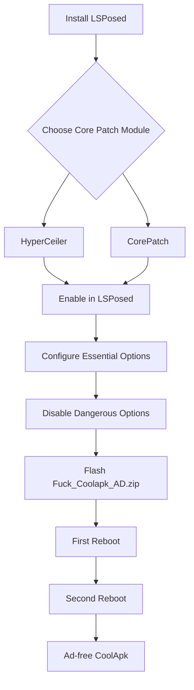

# 酷安广告移除模块使用指南  

---

## 📦 模块功能  
本 Magisk 模块可彻底移除酷安 (CoolApk) 应用内的所有广告，需配合 **HyperCeiler** 或 **CorePatch** 的核心破解功能使用。

---

## ⚙️ 前置条件  
### 1. 安装 LSPosed 框架  
- **必须使用最新版 LSPosed** (Zygisk 版本)  
- [官方下载](https://github.com/LSPosed/LSPosed/releases)  

### 2. 安装核心破解模块 (二选一)  
| 模块 | 支持系统 | 下载地址 |  
|------|----------|----------|  
| **HyperCeiler** | Android 9-15 | [GitHub Release](https://github.com/ReChronoRain/HyperCeiler/releases) |  
| **CorePatch(核心破解)** | Android 9-15 | [GitHub Release](https://github.com/LSPosed/CorePatch/releases) |  

---

## 🔧 核心破解配置指南  
### ▶️ HyperCeiler 配置  
1. 在 LSPosed 中启用 **HyperCeiler** 并勾选 **系统框架**  
2. 打开 HyperCeiler → `系统框架` → `包管理服务`  
3. **必须开启以下选项**：  
   ```markdown
   ✅ 允许降级安装应用  
   ✅ 禁用软件包管理器签名验证  
   ✅ 禁用 APK 签名验证  
   ✅ 禁用低 API 校验  
   ✅ 禁用持久性检查  
   ✅ 禁用安装包验证代理  
   ✅ 禁用隔离应用检查  
   ✅ 允许安装系统应用  
   ```
   > ⚠️ 必须**关闭**"安装时始终使用已装APP的签名"（危险选项）

### ▶️ CorePatch(核心破解) 配置  
1. 在 LSPosed 中启用 **CorePatch** 并勾选 **Android 系统**  
2. 打开 CorePatch 进行配置：  
   ```markdown
   ✅ 允许降级安装应用  
   ✅ 禁用软件包管理器签名验证  
   ✅ 禁用 APK 签名验证  
   ✅ 绕过黑名单  
   ✅ 绕过共享用户签名验证  
   ✅ 禁用安装包验证代理  
   ```
   > ⚠️ 必须**关闭**"安装时始终使用已装APP的签名"（危险选项）

---

## 📥 安装模块  
1. 在 Magisk 中刷入模块 `Fuck_Coolapk_AD.zip`  
2. **强制重启两次**：  
   - 第一次重启：应用核心破解配置  
   - 第二次重启：激活广告移除模块  
3. 打开酷安 → 验证广告已消失  

---

## ❓ 常见问题  
**Q：模块刷入后广告仍在？**  
A：请检查：  
- 是否严格按上述要求配置所有选项  
- LSPosed 中已启用 HyperCeiler/CorePatch  
- 模块在 Magisk 中显示为已启用  
- 尝试清除酷安应用数据  

**Q：安装失败怎么办？**  
A：确保：  
1. 已禁用"安装时始终使用已装APP的签名"  
2. 已开启所有必需选项  
3. 使用最新版 LSPosed  

---

## 🌐 技术支持  
- 模块问题反馈：[Issues](https://github.com/yourname/coolapk-adblock/issues)  
- HyperCeiler 支持：[Telegram 群组]（https://t.me/HyperCeiler）  
- CorePatch 支持：[Discord 社区](https://discord.gg/lsposed)  

---


## 📦 Module Functionality  
This Magisk module completely removes all ads in CoolApk app, requires **HyperCeiler** or **CorePatch** core patching features.  

---

## ⚙️ Prerequisites  
### 1. Install LSPosed Framework  
- **Must use latest LSPosed** (Zygisk version)  
- [Official Download](https://github.com/LSPosed/LSPosed/releases)  

### 2. Install Core Patch Module (Choose One)  
| Module | Supported OS | Download |  
|--------|--------------|----------|  
| **HyperCeiler** | Android 9-15 | [GitHub Release](https://github.com/ReChronoRain/HyperCeiler/releases) |  
| **CorePatch** | Android 9-15 | [GitHub Release](https://github.com/LSPosed/CorePatch/releases) |  

---

## 🔧 Core Patching Configuration  
### ▶️ HyperCeiler Setup  
1. Enable **HyperCeiler** in LSPosed and check **System Framework**  
2. Open HyperCeiler → Go to `System Framework` → `Package Management Service`  
3. **Essential options**:  
   ```markdown
   ✅ Allow Downgrade Installation  
   ✅ Disable Package Manager Signature Verification  
   ✅ Disable APK Signature Verification  
   ✅ Disable Low API Check  
   ✅ Disable Persistent Check  
   ✅ Disable Package Verification Proxy  
   ✅ Disable Isolated App Check  
   ✅ Allow System App Installation  
   ```
   > ⚠️ **Disable** "Always use installed app signature" (dangerous option)

### ▶️ CorePatch Setup  
1. Enable **CorePatch** in LSPosed and check **Android System**  
2. Configure CorePatch:  
   ```markdown
   ✅ Allow Downgrade Installation  
   ✅ Disable Package Manager Signature Verification  
   ✅ Disable APK Signature Verification  
   ✅ Bypass Blacklist  
   ✅ Bypass Shared User Signature Verification  
   ✅ Disable Package Verification Proxy  
   ```
   > ⚠️ **Disable** "Always use installed app signature" (dangerous option)

---

## 📥 Installation  
1. Flash module `Fuck_Coolapk_AD.zip` in Magisk  
2. **Double Reboot Procedure**:  
   - First reboot: Apply core patch settings  
   - Second reboot: Activate ad removal module  
3. Open CoolApk → Verify ads are removed  

---

## ❓ FAQ  
**Q: Ads still appear?**  
A: Verify:  
- All required options are enabled as above  
- HyperCeiler/CorePatch enabled in LSPosed  
- Module shows as enabled in Magisk  
- Try clearing CoolApk app data  

**Q: Installation failed?**  
A: Ensure:  
1. "Always use installed app signature" is DISABLED  
2. All essential options are ENABLED  
3. Using latest LSPosed version  

---

## 🌐 Support  
- Module issues: [GitHub Issues](https://github.com/yourname/coolapk-adblock/issues)  
- HyperCeiler support: [Telegram Group](https://t.me/HyperCeiler)  
- CorePatch support: [Discord Community](https://discord.gg/lsposed)  


